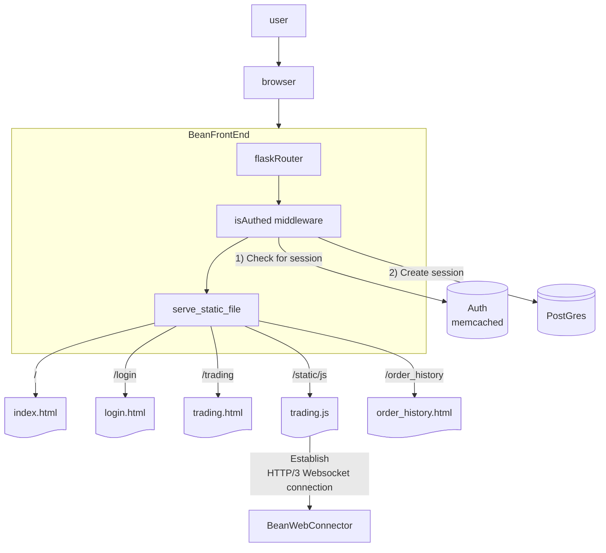

# BeanFrontEnd™

The BeanFrontEnd is a fastAPI server that
serves static files to users.
The application is stateless, everything it needs is contained within its docker image.

It serves as the "frontend" of the exchange.

The trading JS file establishes an SSE connection to the BeanWebConnector™, that listens for the latest price updates and renders them in the UI.

