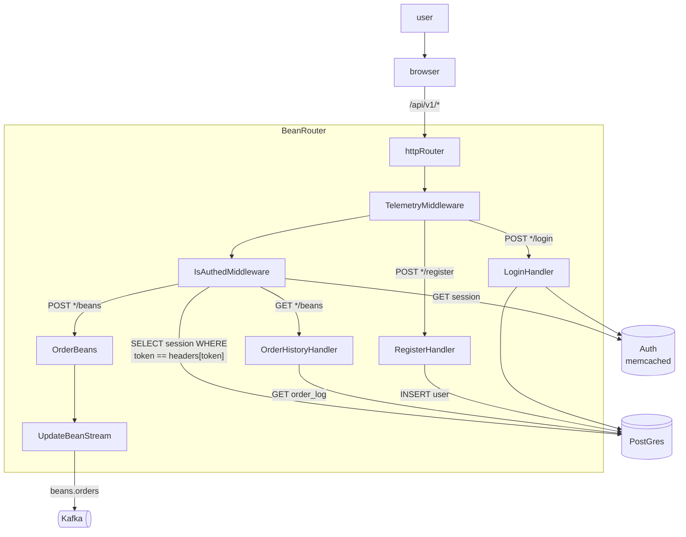

# BeanRouter™




- Language: Go lang
- Description: |\
    Does this also do the the SEQ?
    We can have SLA's on our services.
    e.g. if you send a request to X queue, you will be be sequenced within X.
    We don't have SLAs on matching, we have them on SEQ.
    Doesn't matter when they WANT to be matched, what we need in a totally ordered queue, and they race to be the number one of that queue....
    Ordering is handled at the BEANRouter, sequencing is handled from kafka.


#### Path schemas

> POST */register

The register endpoint is used to register new user accounts.


```json
// data
{
    "username": "str",
    "password": "str"
}
// response/s
// Success
// status: 200
{
    "msg": "str",
}
// Failure
// status: 400
{
    "msg": "str",
    "error": "str" 
}
```

> POST */login

```json
// data
{
    "username": "str",
    "password": "str"
}
// response/s
// Success
// status: 200
{
    "session_token": "str"
}
// Failure
// status: 401
{
    "msg": "str",
    "error": "str" 
}
```

> GET */beans


```json
// Headers
// token: ${SESSION_TOKEN}
// Parameters
?
// response/s
// Success
// status: 200
{
    "orders": [
        "${order_log.fill_id}": {"${order_log}"}
    ]
}
// Failure
// status: 401
{
    "msg": "str",
    "error": "str" 
}
// Parameters
?page=int
// response/s
// Success
// status: 200
{
    "orders": [
        "${order_log.fill_id}": {"${order_log}"}
    ][page:]
}
// Failure
// status: 400
{
    "msg": "str",
    "error": "str" 
}
```

> POST */beans

```json
// Headers
// token: ${SESSION_TOKEN}
// data
{
    "quantity": "int",
    "price": "int",
    "beantype": "str",
    "ordertype": "str",
    "userid": "str",
    "orderid": "str",
    "expires": "timestamp"
}
// Failure
// status: 400
{
    "msg": "str",
    "error": "str" 
}
```

